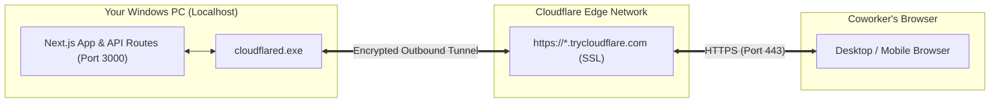

# Cloudflare Quick Tunnel Sharing Guide — Marketing Output UI

This guide explains how to share the **HomeCartel Marketing Output UI** (`http://localhost:3000`) with coworkers anywhere in the world for **100% free**, with **zero account configuration**, **no credit card**, and **no custom domain** required.

---

## 1. Quickstart (How to Share with Coworkers)

### Method A: Double-Click (Recommended for Windows)
1. In Windows File Explorer, navigate to:
   ```
   C:\Users\User\Downloads\Marketing Output UI\
   ```
2. Double-click **`launch_ui_cloudflare.bat`**.
3. A terminal window will open, ensure your Next.js server is running on port 3000, start the Cloudflare tunnel, and print your public HTTPS link:
   ```
   ============================================================================
     SUCCESS! YOUR MARKETING OUTPUT UI IS LIVE ON THE INTERNET
   ============================================================================

     >> Public HTTPS Link : https://xxxx-xxxx-xxxx.trycloudflare.com
        [Copied to clipboard! Ready to paste into Slack / Teams / Browser]
     >> Local Port        : http://localhost:3000
     >> Security Access   : Open Access (No PIN required)

     Coworker Access:
     - Anyone with this link can view the Content Calendar (Months & Days).
     - Coworkers can inspect scheduled Feeds, Reels, and Stories.
     - Generated assets and previews are served seamlessly via the tunnel.

   ----------------------------------------------------------------------------
     Keep this terminal open while coworkers are using the UI.
     Press Ctrl + C at any time to shut down the public tunnel.
   ============================================================================
   ```
4. Paste the link into Slack, Microsoft Teams, or WhatsApp for your coworkers.

---

### Method B: Command Line (CLI)
From any terminal inside this folder:
```bash
python launch_ui_cloudflare.py
```

Optional CLI flags:
- `--port 3000`: Specify local port (defaults to 3000).
- `--no-copy`: Do not automatically copy the URL to the clipboard.
- `--prod`: Start production server (`pnpm start`) instead of dev server.
- `--test-only`: Test tunnel connectivity and shut down automatically after 5 seconds.

---

## 2. Coworker Capabilities & Access Model

| Feature | Remote Coworker Access |
| :--- | :---: |
| **Browse Monthly Content Calendar (July, August, Sept)** | ✅ Allowed |
| **View Day Detail Modals & Scheduled Content** | ✅ Allowed |
| **Filter by Category (Feeds, Reels, Stories)** | ✅ Allowed |
| **Preview High-Res Generated Media Slides & Videos** | ✅ Allowed |
| **Inspect Airtable IDs, Copy Captions & Details** | ✅ Allowed |
| **Login / Password Required** | ❌ None (Instant Open Access) |

---

## 3. How It Works (Architecture)



1. **Self-Contained Executable**: Re-uses the official binary located at `C:\Users\User\marketing-automation\tools\cloudflared.exe` (or auto-downloads into `tools/` if missing). No admin rights or system installations needed.
2. **Encrypted Quick Tunnel**: Cloudflare establishes an encrypted outbound connection to Cloudflare Edge nodes, assigning a unique HTTPS URL on `trycloudflare.com`.
3. **Zero Port Forwarding**: Operates purely over outbound HTTPS connections (Port 443). Works behind firewalls, VPNs, and home Wi-Fi routers without router configuration.
4. **Fast Turbopack & API Routes**: Next.js handles server routes (`/api/content-outputs`, `/api/media/[...path]`) directly on your machine, pulling live data from Airtable and local outputs.

---

## 4. Keeping the Tunnel Active & Shutting Down

- **While coworkers are using it**: Keep the `launch_ui_cloudflare.bat` terminal window open, and ensure your computer does not go into sleep mode.
- **When finished**: Press **`Ctrl + C`** in the terminal window to shut down the tunnel. The public link immediately stops working and all processes exit cleanly.
